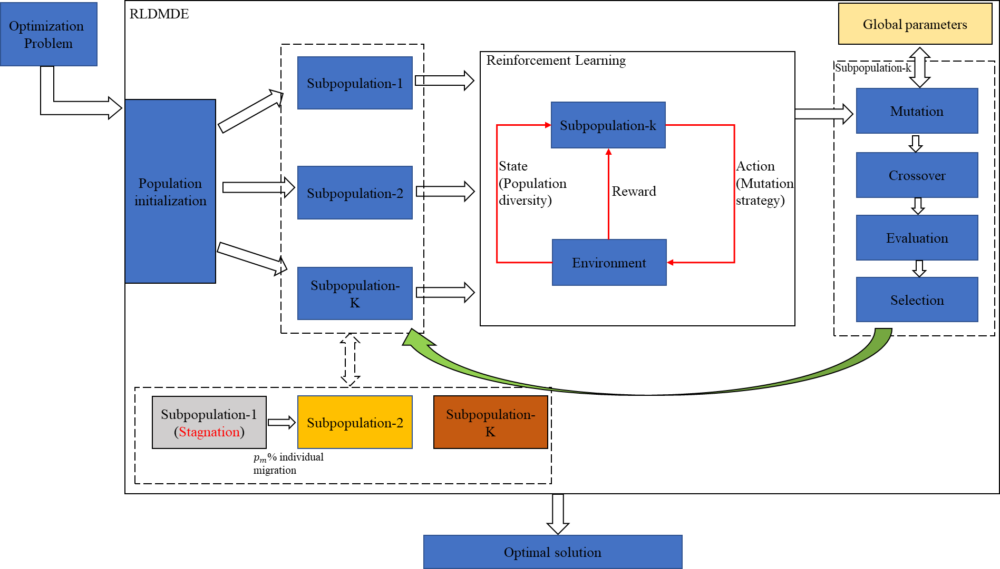

# Paper: Dynamic multi-strategy integrated differential evolution algorithm based on reinforcement learning for optimization problems

## Abstract
The introduction of a multi-population structure in differential evolution (DE) algorithm has been proven to be an effective way to achieve algorithm adaptation and multi-strategy integration. However, in existing studies, the mutation strategy selection of each subpopulation during execution is fixed, resulting in poor self-adaptation of subpopulations. To solve this problem, a dynamic multi-strategy integrated differential evolution algorithm based on reinforcement learning (RLDMDE) is proposed in this paper. By employing reinforcement learning, each subpopulation can adaptively select the mutation strategy according to the current environmental state (population diversity). Based on the population state, this paper proposes an individual dynamic migration strategy to “reward” or “punish” the population to avoid wasting individual computing resources. Furthermore, this paper applies two methods of good point set and random opposition-based learning (ROBL) in the population initialization stage to improve the quality of the initial solutions. Finally, to evaluate the performance of the RLDMDE algorithm, this paper selects two benchmark function sets, CEC2013 and CEC2017, and six engineering design problems for testing. The results demonstrate that the RLDMDE algorithm has good performance and strong competitiveness in solving optimization problems.

## The overall framework of the RLDMDE algorithm


## Available
**Link1**: https://link.springer.com/article/10.1007/s40747-023-01243-9

**Link2**: https://doi.org/10.1007/s40747-023-01243-9

## How to run
Execute the **main.m**.

## Note  
This project was developed with **MATLAB 2019b**. Early versions of MATLAB may have incompatibilities.

## Citation
If you find this work valuable or use our code in your own research, please consider citing us:
```
@article{yang2023dynamic,
  title={Dynamic multi-strategy integrated differential evolution algorithm based on reinforcement learning for optimization problems},
  author={Yang, Qingyong and Chu, Shu-Chuan and Pan, Jeng-Shyang and Chou, Jyh-Horng and Watada, Junzo},
  journal={Complex \& Intelligent Systems},
  pages={1--33},
  year={2023},
  publisher={Springer},
  doi = {10.1007/s40747-023-01243-9}
}
```
